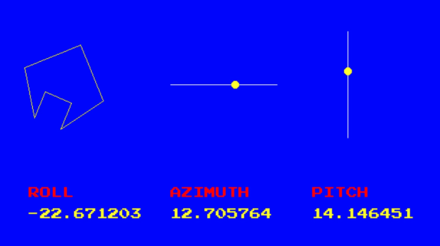

PixFu Template Project and Demos
================================

What is PixFu
=============

PixFu is a minimalistic modular game / realtime system engine. It is 100% written in C++ and OpenGL and runs on Desktop computers and Mobile devices (Android at the moment, IOS coming next).

PixFu core is based on famous engine OneLoneCoder Pixel Game Engine (http://onelonecoder.com) and has a redesigned full modular approach to allow optimizations for mobile devices and embedded platforms.

 Core: OpenGL initialization, platform abstraction, android/ios launchers

 Input Devices: Keyboard, Mouse, Virtual Mouse, Virtual Keyboard, Axis Controller, Gyroscope

 Extensions:

    - Primary Surface: provides a 2D canvas with functions to draw circles, lines, rectangles and multi-font strings. This extension is enabled by default. Source code for this extension comes from OLC PGE core. 
    
    - Sprites: OpenGL/powered sprites with scaling, rotation, fx and multi sprite atlas support

    - World: Complete minimalistic 3D world with terrain model, height maps, lighting, camera, and 3D-model object clusters with multi-texture support, optimized for mobile devices. 

Other Features:

    - OLC Pixel Game Engine compatibility layer, provides a base class that mimics the PGE Engine class. You can easily port your PGE modules to PixFu! (Note- Extensions are not supported, and not all functionality is emulated)

    - Includes GLM library, used internally, but also exported so it is ready to use in your project just including it. The library is compiled with FORCE_LEFT_HANDED, so angles are positive clockwise and physics behave as expected.
    
    - 100% modular structure allows to enable just the features you need. Even the primary UI surface is an extension that maybe you don't need to enable to get some fps!

How To Start
=============

This is a template Android Studio project that you can use to create your PixFu based applications.

It includes the PixFu/Android core as an AAR, and all build scripts and CMAKE configurations ready so you just can deploy one class, hit build and play the application in your phone.

Please refer to the root project PixFu https://github.com/nebular/PixFu_Android for technical details.

Pre-requisites
--------------
- Android Studio 3.5.2+ (lower may work)
- (not sure if you also need to install the NDK, easy anyways:  [NDK] (https://developer.android.com/ndk/) bundle.

Getting Started
---------------
1. Clone this project

`git clone https://github.com/nebular/PixFu_Android_demos.git
`
1. Open it in Android Studio

1. Press Play

What works / How it works / What does not work yet
--------------------------------------

- You just compile your classes without the "main" function and your application should at least be displayed.
- In order to send keys and mouse, keep reading below, there are is a helper class to do it. 

- graphics: there not seem to be many problems in this area, other than some Android peculiarities 
(...) main of which is, your OnUserCreate() can be called several times: When the application
is sent to background Android destroys the OpenGL context and frees all textures, so when bringing the
app back into foreground we have to recreate all OpenGL context. You might need to keep this in mind
in your onUserCreate.

- I haven't tested any extension yet, I guess that complex extensions will better be integrated in the core project. You are encouraged to fork the root project and submit pull requests with your extensions!

- Mouse events: I wrote a simple touch emulator. The goal was rather to quickly have something that accurately
simulates the basic mouse actions (click/drag/move) from touch. After some tests I decided to go with a system where
you use one finger to point anywhere, then there are 2 virtual buttons on screen you can
press with the other finger. This way you will be able to click/drag/move with primary and secondary button
predictably. In order to support gestures, etc.. I'd go with an extension to properly support touch separate from the mouse. 
Keep in mind in the mouse click detections radiuses have to be coarser as the fingers are less precise than the mouse. I have found a *2-*3 ratio is OK.

- Keys Events: You can easily add virtual keys anywhere on the screen and build control clusters (look at the boxes near the top corners):

`		

        LoneScreenKey::currentInstance->add({olc::Key::W,    540,   0, 100, 50});

		LoneScreenKey::currentInstance->add({olc::Key::A,    540,  50,  50, 50});
		
		LoneScreenKey::currentInstance->add({olc::Key::D,    590,  50,  50, 50});
		
		LoneScreenKey::currentInstance->add({olc::Key::S,    540, 100, 100, 50});
`

 
- gyroscope sensor data is provided as a courtesy of the Java layer. An object tCurrentSensorEvent is available in the update loop.

  

    - At the moment the gyroscope is "always on", that consumes a lot of battery, will add methods to start and stop.
    
- So please feel free to contribute!

Start Developing
---------------
1. Place your application code in *app/src/main/cpp*
1. Place your application assets in *app/src/main/assets*
1. Instantiate your main class in the file *run.cpp*
1. Click *Run/Run 'app'*.

Support
-------
If you've found an error please [file an issue] (https://github.com/nebular/olcPGE_Android/issues/new).

Patches are encouraged, and may be submitted by [forking this project](https://github.com/nebular/olcPGE_Android/fork) and submitting a pull request through GitHub.

License
-------

https://creativecommons.org/licenses/by/4.0/
