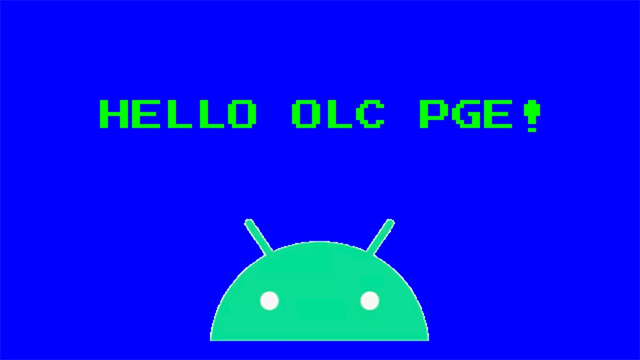
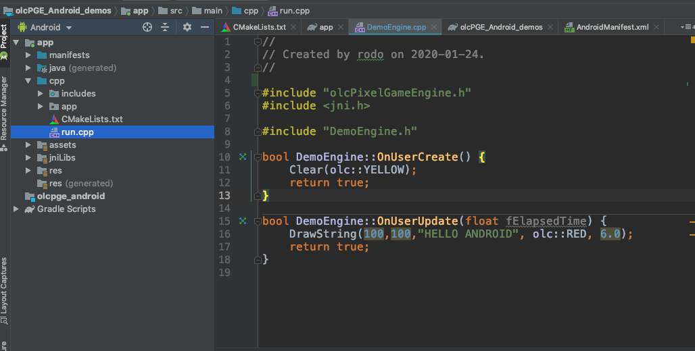

PixelGameEngine Demo
====================

This is a template Android Studio project that you can use to create your OLC/PGE based applications and add an additional layer of fun to the teachings of @javidx9 !

It includes the OLC PGE/Android core as an AAR, and all build scripts and CMAKE configurations ready so you just can deploy one class, hit build and play the application in your phone.

Please refer to the root project OLC/Android https://github.com/nebular/olcPGE_Android for technical details.

Pre-requisites
--------------
- Android Studio 3.5.2+ (lower may work)
- (not sure if you also need to install the NDK, easy anyways:  [NDK] (https://developer.android.com/ndk/) bundle.

Getting Started
---------------
1. Clone this project

`git clone https://github.com/nebular/olcPGE_Android_demos.git
`
1. Open it in Android Studio

1. Press Play

What works / What  does not work yet
--------------------------------------

In general I just got all this running these days, and the hard pat is done. Expect a lot of finetunning these days!
What works:

- graohics layer: everything from olc:PGE. PGEX3d is included in the so libraries, but not tested yet, I guess it should work.

- Mouse events: Very early state !!! GetMouse() will be the touch position, and MouseButtons the number of fingers

    --> I will create a proper touch controller next days, or so can you. The layer that sends the touch
    events from Java to C++ is done, and the MotionEvent is serialized to the C++ layer, so you
    have all the xoordinates and pointer info to inject them how it makes sense into olc mouse events

- Keys:  Emulation: with a provided easy "lonekey" class you can add rectangles on screen that generate
  olc::Keys (correctly, bHeld, bPressed, etc) and with 2 touch support.
  
- gyroscope sensor data is provided as a courtesy of the Java layer. At the moment a "LoneSensor" class is provided
  so you can use it as an (analog) Joystick/
  
    --> working on further integrating this
    
- So please feel free to contribute!

Start Developing
---------------
1. Place your application code in *app/src/main/cpp*
1. Place your application assets in *app/src/main/assets*
1. Instantiate your main class in the file *run.cpp*
1. Click *Run/Run 'app'*.

Support
-------
If you've found an error please [file an issue] (https://github.com/nebular/olcPGE_Android/issues/new).

Patches are encouraged, and may be submitted by [forking this project](https://github.com/nebular/olcPGE_Android/fork) and submitting a pull request through GitHub.

License
-------

https://creativecommons.org/licenses/by/4.0/
