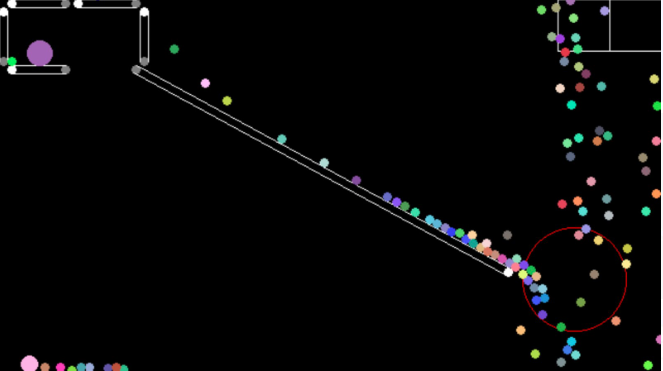
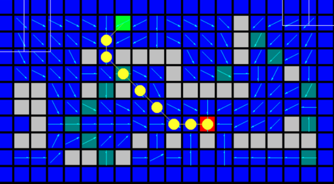
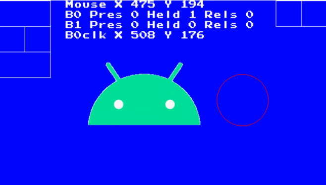

PixelGameEngine Demo
====================

This is a template Android Studio project that you can use to create your OLC/PGE based applications and add an additional layer of fun to the teachings of @javidx9 !

It includes the OLC PGE/Android core as an AAR, and all build scripts and CMAKE configurations ready so you just can deploy one class, hit build and play the application in your phone.

Please refer to the root project OLC/Android https://github.com/nebular/olcPGE_Android for technical details.

Pre-requisites
--------------
- Android Studio 3.5.2+ (lower may work)
- (not sure if you also need to install the NDK, easy anyways:  [NDK] (https://developer.android.com/ndk/) bundle.

Getting Started
---------------
1. Clone this project

`git clone https://github.com/nebular/olcPGE_Android_demos.git
`
1. Open it in Android Studio

1. Press Play

What works / What  does not work yet
--------------------------------------

- graphics: there not seems to be problems in this area, other than some Android peculiarities 
(to be expanded) man of which is, your OnUserCreate() can be called several times: When the application
is sent to background Android destroys the OpenGL context and frees all textures, so when bringing the
app back into foreground we have to recreate all OpenGL context. You might need to keep this in mind
in your onUserCreate.

- Mouse events: I wrote a simple touch emulator. The goal was rather to quickly have something that accurately
simulates the basic mouse actions (click/drag/move) from touch. After some tests I decided to go with a system where
you use one finger to point anywhere, then there are 2 virtual buttons on screen you can
press with the other finger. This way you will be able to click/drag/move with primary and secondary button
predictably. In order to support gestures, etc.. I'd go with an extension to properly support touch separate from the mouse. 
Keep in mind in the mouse click detections radiuses have to be coarser as the fingers are less precise than the mouse. I have found a *2-*3 ratio is OK.

- Keys Events: You can easily add virtual keys anywhere on the screen and build control clusters:

`		LoneScreenKey::currentInstance->add({olc::Key::W,    540,   0, 100, 50});
		LoneScreenKey::currentInstance->add({olc::Key::A,    540,  50,  50, 50});
		LoneScreenKey::currentInstance->add({olc::Key::D,    590,  50,  50, 50});
		LoneScreenKey::currentInstance->add({olc::Key::S,    540, 100, 100, 50});
`

 
- gyroscope sensor data is provided as a courtesy of the Java layer. An object tCurrentSensorEvent is available.
  
    --> working on further integrating this
    
- So please feel free to contribute!

Start Developing
---------------
1. Place your application code in *app/src/main/cpp*
1. Place your application assets in *app/src/main/assets*
1. Instantiate your main class in the file *run.cpp*
1. Click *Run/Run 'app'*.

Support
-------
If you've found an error please [file an issue] (https://github.com/nebular/olcPGE_Android/issues/new).

Patches are encouraged, and may be submitted by [forking this project](https://github.com/nebular/olcPGE_Android/fork) and submitting a pull request through GitHub.

License
-------

https://creativecommons.org/licenses/by/4.0/
